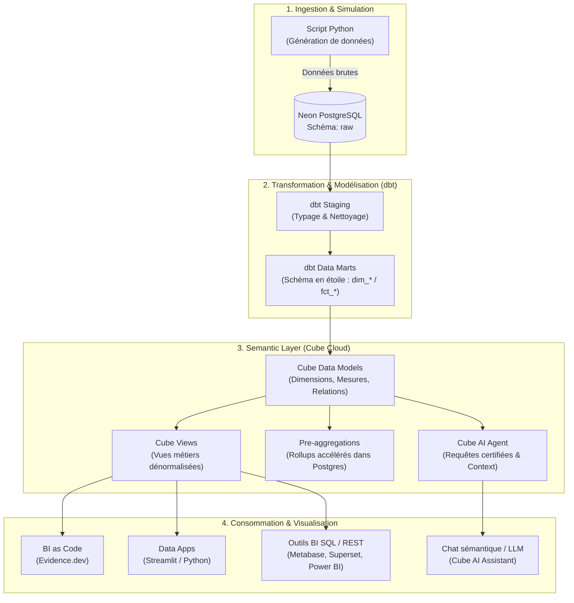

# 📦 Supply Chain BI — Modern Semantic Layer avec Cube Cloud

[](https://cube.dev/)
[](https://www.getdbt.com/)
[](https://neon.tech/)
[](#-architecture-finops--100-free-tier)
[](LICENSE)

Projet de **couche sémantique (Semantic Layer)** et d'**Analytics Engineering** pour le pilotage d'une chaîne logistique et commerciale (*Supply Chain*). 

Ce dépôt héberge la modélisation sémantique **Cube** (cubes, dimensions, mesures agrégées, jointures, vues orientées métier et agent IA), conçue pour alimenter des applications décisionnelles, des outils de BI ou des agents d'interrogation en langage naturel, le tout opéré **100% en ligne sur des services Free Tier**.

---

## 🎯 Objectifs Métier & Cas d'Usage

Dans une chaîne d'approvisionnement moderne, les données proviennent de multiples sources (ERP, WMS, CRM, transporteurs). Cette couche sémantique unifie les définitions et centralise le calcul des métriques critiques :

* **📦 Gestion des Stocks & Ruptures** : Suivi journalier de la valorisation des stocks, analyse des quantités disponibles vs en transit, détection des ruptures et classification ABC.
* **🚚 Performance Logistique & Commandes** : Mesure du respect des délais de livraison (Lead Time réel vs prévisionnel), calcul du **Taux de Service (OTIF)** et analyse des retards par canal de distribution.
* **💰 Ventes & Rentabilité** : Analyse du Chiffre d'Affaires net HT, de la marge brute et du taux de marge par catégorie produit, segment client et canal de vente.
* **📉 Ventes Perdues (Manque à Gagner)** : Quantification financière des pertes liées aux ruptures de stock avec identification des motifs de rupture.
* **🚢 Achats & Approvisionnements** : Dépenses d'achat cumulées, suivi des réceptions, coûts de transport alloués et ponctualité des routes logistiques fournisseurs.

---

## 🏗️ Architecture Globale de la Stack

Le pipeline s'appuie sur le pattern **Modern Data Stack** :



---

## 📊 Modèle de Données Sémantique

### Cubes Principaux (Tables de Faits & Dimensions)

| Cube | Type | Source dbt / Postgres | Description Métier |
| :--- | :---: | :--- | :--- |
| [`ventes`](model/cubes/ventes.yml) | Fait | `dbt.fct_ventes` | Ventes réalisées, CA HT, marge brute, taux de remise |
| [`commandes`](model/cubes/commandes.yml) | Fait | `dbt.fct_commandes` | Suivi logistique, lead time, retards et taux de service |
| [`stock_journalier`](model/cubes/stock_journalier.yml) | Fait | `dbt.fct_couverture_stock` | Niveaux de stocks journaliers, valeur de stock, classe ABC |
| [`achats`](model/cubes/achats.yml) | Fait | `dbt.fct_achat` | Commandes fournisseurs, réceptions, délais et coûts de transport |
| [`ventes_perdues`](model/cubes/ventes_perdues.yml) | Fait | `dbt.stg_ventes_perdues` | Pertes financières dues aux ruptures de stock |
| [`produits`](model/cubes/produits.yml) | Dimension | `dbt.dim_produits` | Référentiel articles, marques, catégories, prix & coûts de base |
| [`clients`](model/cubes/clients.yml) | Dimension | `dbt.dim_clients` | Portefeuille clients, segmentation B2B/B2C, localisation |
| [`fournisseurs`](model/cubes/fournisseurs.yml) | Dimension | `dbt.dim_fournisseurs` | Référentiel des partenaires d'approvisionnement et pays |
| [`canaux_vente`](model/cubes/canaux_vente.yml) | Dimension | `dbt.stg_canaux_vente` | Canaux de distribution, modes d'expédition et SLA |
| [`routes_achat`](model/cubes/routes_achat.yml) | Dimension | `dbt.stg_routes_achat` | Routes de transport, délais théoriques et coûts forfaitaires |
| [`villes`](model/cubes/villes.yml) | Référentiel | `raw.villes` (dédupliqué) | Coordonnées GPS, codes INSEE et population |

### Vues Métier (`model/views/`)

Les vues Cube exposent une interface prête à l'emploi pour les outils de reporting, masquant la complexité des jointures :

* **`ventes_view`** : Analyse multidimensionnelle des ventes par produit, client, canal et géographie.
* **`commandes_view`** : Tableau de bord de ponctualité logistique et d'exécution des commandes.
* **`stock_view`** : Évolution temporelle des niveaux et valeurs de stock par référence.
* **`achats_view`** : Analyse de la performance des fournisseurs et suivi des dépenses d'achat.
* **`ventes_perdues_view`** : Analyse des causes racines de perte de chiffre d'affaires.

---

## ⚡ Architecture FinOps : 100% Free Tier

Ce projet a été conçu pour tourner en continu sans générer de coûts d'infrastructure :

1. **Neon Serverless PostgreSQL** :
   * Stockage < 500 Mo grâce à une volumétrie simulée calibrée pour la démonstration.
   * Mise en veille automatique (*Scale-to-zero*) lors des périodes d'inactivité, réveil transparent lors des requêtes Cube.
2. **dbt & Orchestration** :
   * Exécution des transformations dbt et du script de simulation via **GitHub Actions** (crédits gratuits mensuels CI/CD).
3. **Cube Cloud** :
   * Déploiement sur le plan gratuit de Cube Cloud connecté directement à ce dépôt GitHub.
   * **Pré-agrégations SQL** : stockées dans un schéma dédié (`cube`) directement sur Neon PostgreSQL via [`cube.py`](cube.py), éliminant le besoin d'un cluster Cube Store dédié.
4. **Front-End / BI** :
   * Compatible avec un hébergement gratuit sur **Vercel** ou **Cloudflare Pages** (ex: application Evidence.dev ou Next.js + Cube API).

---

## 🤖 Cube AI Assistant (`agents/`)

Cube intègre une couche d'assistance sémantique permettant d'interroger les données en langage naturel :

* **Configuration de contexte ([`agents/config.yml`](agents/config.yml))** : Définition des vues autorisées pour l'agent.
* **Requêtes certifiées ([`agents/certified-queries/`](agents/certified-queries/))** : Exemples de requêtes pré-validées servant de *few-shot learning* au LLM pour garantir des réponses exactes.
* **Règles métier ([`agents/rules/`](agents/rules/))** : Définition des fenêtres temporelles par défaut et des règles d'interprétation métier.

---

## 🚀 Démarrage Rapide

### Prérequis

* Node.js (v18+) ou Docker
* Accès à une instance PostgreSQL (ex: Neon)

### Développement en Local

1. **Cloner le projet** :
   ```bash
   git clone https://github.com/AzzouzMezlini/cube-supply-chain-bi.git
   cd cube-supply-chain-bi
   ```

2. **Configurer les variables d'environnement** :
   Créer un fichier `.env` à la racine :
   ```env
   CUBEJS_DB_TYPE=postgres
   CUBEJS_DB_HOST=<votre_host_neon>.neon.tech
   CUBEJS_DB_NAME=neondb
   CUBEJS_DB_USER=<votre_user>
   CUBEJS_DB_PASS=<votre_mot_de_passe>
   CUBEJS_DB_SSL=true
   CUBEJS_DEV_MODE=true
   CUBEJS_API_SECRET=mon_super_secret_local
   ```

3. **Lancer Cube en local** :
   ```bash
   # Via Docker (recommandé)
   docker run -d -p 4000:4000 \
     --env-file .env \
     -v $(pwd):/cube/conf \
     cubejs/cube:latest

   # Ou via le CLI Cube
   npm install -g cubejs-cli
   cubejs dev
   ```

4. **Accéder au Playground Cube** :
   Ouvrez [http://localhost:4000](http://localhost:4000) pour tester interactivement les dimensions, mesures, jointures et requêtes SQL générées.

### Déploiement sur Cube Cloud

1. Rendez-vous sur [Cube Cloud](https://cube.dev/).
2. Créez une nouvelle application et connectez ce dépôt GitHub (`master`).
3. Renseignez les identifiants de connexion Neon dans les paramètres de source de données.
4. Activez les notifications de déploiement automatique à chaque `git push`.

---

## 📂 Structure du Répertoire

```text
.
├── cube.py                 # Configuration principale Cube (schéma des pré-agrégations)
├── model/
│   ├── cubes/              # Définitions des Cubes (dimensions, mesures, jointures)
│   │   ├── ventes.yml
│   │   ├── commandes.yml
│   │   ├── stock_journalier.yml
│   │   ├── achats.yml
│   │   ├── ventes_perdues.yml
│   │   ├── produits.yml
│   │   ├── clients.yml
│   │   ├── fournisseurs.yml
│   │   ├── canaux_vente.yml
│   │   ├── routes_achat.yml
│   │   └── villes.yml
│   └── views/              # Vues sémantiques exposées aux outils de BI
│       ├── ventes_view.yml
│       ├── commandes_view.yml
│       ├── stock_view.yml
│       ├── achats_view.yml
│       ├── ventes_perdues_view.yml
│       ├── clients_view.yml
│       └── produits_view.yml
├── agents/                 # Configuration de l'agent IA Cube (requêtes certifiées, règles)
│   ├── config.yml
│   ├── certified-queries/
│   └── rules/
├── target/                 # (Local / GitIgnored) Catalogues et schémas compilés par dbt
└── requirements.txt        # Dépendances Python pour scripts d'utilitaires
```

---

## 👤 Auteur & Contact

* **Auteur** : Azzouz Mezlini
* **Projet** : Portfolio Data Engineering & Analytics Engineering
* **GitHub** : [@AzzouzMezlini](https://github.com/AzzouzMezlini)
